  

<h1 align="center">¡Hola! 👋</h1>

  <em>Estudiante de Desarrollo de Software · Apasionado por el desarrollo web y la creación de proyectos con impacto real</em>

---

##  Sobre mí
- 🎓 Actualmente estudiante de **Desarrollo de Software**  
- 💡 Interés en **frontend** y **backend**  
- 🌱 Siempre aprendiendo nuevas tecnologías y mejorando mis proyectos  

---

## 🔗 Encuéntrame

---

## 📌 Proyectos destacados
- **Súbete** – Plataforma web para compartir viajes entre personas que van al mismo destino.  
- **TBService** – Sistema de gestión para talleres de reparación de celulares desarrollado en Visual Basic .NET y SQL Server.    
- **Catálogo de Ropa Web** – Página con HTML, CSS y JS mostrando un catálogo navegable.  

---

## 📊 Mis Stats  

  
  

---

